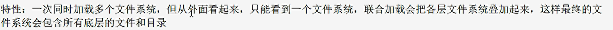
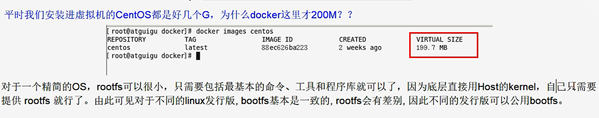
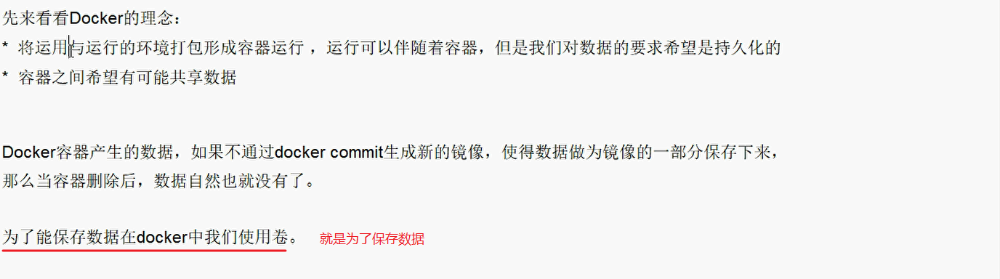

[TOC]


# Docker简介

+ Docker：一次构建，处处运行
+ 解决了运行环境和配置问题软件容器，方便做持续集成并有助于整体发布的容器虚拟化技术


## 发展历程

### 之前的虚拟机技术


### 容器虚拟化技术


### 开发/运维（DevOps）

+ 一次构建，随处运行
  + 更快速的应用交付和部署
  + 更便捷的升级和扩缩容
  + 更简单的系统运维
  + 更高效的计算资源利用

## 下载Docker

+ 官网
  + https://www.docker.com/
+ DockerHub：https://hub.docker.com/
  + docker hub类似于github


# Docker安装

## Docker架构图


## Docker基本组成

+ 镜像（image）


+ 容器（container）


+ 仓库（repository）


+ 镜像、容器、仓库之间的关系


## Ubuntu18.04下docker的安装

参考：https://yq.aliyun.com/articles/625340

验证是否安装了curl

```
which curl
```

备注：如果没有安装则进行安装，具体安装如下：

```
sudo apt-get update
sudo apt-get install curl
```

在Ubuntu中建立ce存储库
第一步：安装软件包以允许apt通过HTTPS使用存储库：

```
sudo apt-get install apt-transport-https ca-certificates curl software-properties-common
```

第二步：添加Docker的官方GPG密钥：

```
curl -fsSL https://download.docker.com/linux/ubuntu/gpg | sudo apt-key add -
```

执行完之后返回给你`OK`

第三步：可选设定稳定存储库，可不设置，则自动使用（deb [arch=amd64] https://download.docker.com/linux/ubuntu xenial stable）
注：官方文档提到在此处设置时，如果是在linux mint下，则需要设置父级Ubuntu发行版的名称。Linux Mint Rafaela、Ubunut版本直接使用 lsb_release -cs命令获取到的名称即可

```
sudo add-apt-repository "deb [arch=amd64] https://download.docker.com/linux/ubuntu  xenial  stable"
```

第四步，更新apt资源包，并进行安装docker ce：

```
sudo apt-get update
sudo apt-get -y install docker-ce
```

第五步，基础安装完成，可以先进行测试一下是否可用

```
sudo docker version
sudo docker run hello-world
```

如果执行时不想使用sudo命令，可以进行设置用户组，并将当前用户增加到该组中:

```
sudo groupadd docker
sudo usermod -aG docker $USER
# 注销一下，再执行以下命令
docker run hello-world
```

### 配置阿里云docker镜像加速器

上面完成之后执行：

```
vim /etc/docker/daemon.json
```

增加内容：

```json
{
        "registry-mirrors": ["https://aa25jngu.mirror.aliyuncs.com"]
}
```

接着再重启服务即可：

```
systemctl daemon-reload
systemctl restart docker  # 也可以只执行 service docker restart
systemctl status docker
```


## 测试hello-world

原理：`docker run 镜像名称`这样docker会生成一个容器实例


### run命令干了什么？


## 附：Docker卸载

centos7下的操作：

```
systemctl stop docker
yum -y remove docker-ce
rm -rf /var/lib/docker
```


# Docker底层原理


## 为什么Docker比VM快？


# Docker常用命令

## 帮助命令

+ `docker version`
+ `docker info` 比version信息更全面
+ `docker --help`


## 镜像命令


从Docker的图标可以看出：

蓝色的大海：宿主机系统

鲸鱼：docker

鲸鱼背上的集装箱：容器实例（来自我们的镜像模板）


+ `docker images`列出本地主机上的镜像
  + `-a`列出本地所有镜像（含中间映像层）
  + `-q`只显示镜像ID
  + `--digests`显示镜像的摘要信息
  + `--no-trunc`显示完整的镜像信息


+ `docker search 某个XXX镜像名字` 去docker hub上找相应的镜像
  + `docker search -s 30 tomcat`把star超过30的tomcat镜像显示出来
  + `docker search --no-trunc tomcat` 显示出完整的镜像描述
  + `docker search --automated tomcat` 只列出automated build 类型的镜像
+ `docker pull 某个XXX镜像名字` 下载镜像
  + `docker pull tomcat`等价于`docker pull tomcat:lastest`
  + 所以你想要下载某个具体版本的镜像：`docker pull XXX:[TAG版本]`
+ `docker rmi 某个XXX镜像名字[:TAG版本]` 删除镜像
  + 有可能你的docker里面一个镜像你下载了多个版本，你删除时默认删除最新版；你也可以指定版本
  + `docker rmi -f 镜像ID` 删除单个
  + `docker rmi 镜像名1:TAG 镜像名2:TAG` 删除多个
  + `docker rmi -f $(docker images -qa)` 删除全部


## 容器命令

### 基础

+ 有镜像才能创建容器，这是**根本**前提
+ `docker run [OPTIONS] IMAGE [COMMAND] [ARG]` 新建并且启动容器   
  + `docker run -it centos`
  + `docker run -it --name myCentos centos`


+  `docker ps [OPTIONS]`列出当前所有正在运行的容器


+ 退出容器
  + `exit`  容器停止退出
  + `ctrl+P+Q`  容器不停止退出

+ 启动容器
  + 上一点的`退出容器 ctrl+P+Q`那怎么再次返回此容器呢？
  + `docker start 容器ID或者容器名`
+ 重启容器
  + `docker restart 容器ID或者容器名`
+ 停止容器
  + `docker stop 容器ID或者容器名`
+ 强制停止容器
  + `docker kill 容器ID或者容器名`
+ 删除已停止的容器
  + docker会记录你所有启动过的容器记录，你怎么把它们删除？
  + `docker rm 容器ID`
    + `docker rm -f $(docker ps -a -q)`
    + `docker ps -a -q | xargs docker rm`  左边查询的结果通过管道传给xargs再执行右边的命令


### 重要

+ 启动交互式容器：意思就是你启动完你的终端变成docker你启动后的终端，比如`docker run -it centos`执行完后你的当前这个终端会变成docker启动的这个centos的终端，上面一节有介绍
+ 启动守护式容器
  + `docker run -d 容器名`


+ 查看容器日志`docker logs -f -t --tail 数字 容器ID`
  + `-t`加入时间戳
  + `-f`跟随最新的日志打印
  + `--tail 数字` 显示最后多少条


+ 结合上面两点做到docker以守护式启动而且使用`docker ps`还能显示出它的信息

  + 启动守护式容器:`docker run -d centos /bin/sh -c "while true;do echo hello zzyy;sleep 2;done"`
  + 这样可以保证docker一直有一个进程在进行，这样再使用`docker ps`就可以发现这个容器没有被杀死了
  + 再使用`docker logs -f -t --tail 3 XXX`也可以发现一直有日志输出

  


+ 查看容器内运行的进程`docker top 容器ID`

+ 查看容器内部细节`docker inspect 容器ID`
+ 进入正在运行的容器并以命令行交互
  + `docker exec -it 容器ID bashShell命令`
  + `docker attach 容器ID`
  + 区别：`attach`直接进入容器启动命令的终端，不会启动新的进程；`exec`是在容器中打开新的终端，并且可以执行新的进程
  + 总的来说，attach就是进入到docker里面去；exec是将shell命令在docker容器里面执行后把结果返回给宿主机
  + 所以：`docker exec -it 容器ID /bin/bash`可以认为等于`docker attach 容器ID`
+ 从容器内拷贝文件到主机上`docker cp 容器ID:容器内路径 目的主机路径`


# Docker镜像原理

+ 镜像是一种轻量级、可执行的独立软件包，用来打包软件运行环境和基于运行环境开发的软件，它包含运行某个软件所需的所有内容，包括代码、运行时、库、环境变量和配置文件
+ UnionFS：联合文件系统




+ Docker镜像加载原理




+ 分层的镜像


+ Docker镜像为什么采用分层结构？


+ Docker镜像特点
  + Docker镜像都是只读的
  + 当容器启动时，一个新的可写层被加载到镜像的顶部。
  + 这一层通常被称作“容器层”，“容器层”之下的都叫“镜像层”


# Docker镜像commit操作

+ `docker commit`提交容器副本使之成为一个新的镜像
+ `docker commit -m="提交的描述信息" -a="作者" 容器ID 要创建的目标镜像名:[标签名]`


## 关于tomcat

+ 命令`docker run -it -p 8888:8080 tomcat`的意思是你的主机端口8888映射到docker里面的8080
  + `-p 主机端口:docker容器端口`
+ 命令`docker run -it -P tomcat` P是随机分配端口的意思，意思就是主机随机分配一个端口映射到docker的8080端口


# Docker容器数据卷




+ 容器数据卷可以完成容器到主机、主机到容器之间的数据共享；之前的cp命令只能是从容器拷贝数据到主机

+ 容器内添加数据卷的方法
  + 直接命令添加
  + DaockerFile添加

## 直接命令添加

+ 命令：`docker run -it -v /宿主机绝对路径目录:/容器内目录 镜像名`
  + 会在宿主机和容器内自动创建相应的目录完成同步
  + 即使容器使用exit退出后再使用docker start再启动后数据仍能同步
+ 命令（带权限）：`docker run -it -v /宿主机绝对路径目录:/容器内目录:ro 镜像名`
  + ro:read only 代表容器内的这个目录只读不可写


## DockerFile添加

Java中 Hello.java ===> Hello.class

Docker中 images ===> DockerFile

相当于DockerFile是对镜像image的一种源码级的描述


案例演示：

1 根目录下新建myDocker文件夹并进入

2 可在Dockerfile中使用VOLUME指令来给镜像添加一个或者多个数据卷


 

3 File构建

`docker build -f /myDocker/Dockerfile -t zzyy/centos .`

`-f`指定文件路径

`-t`指定后面生成的repository名字

别忘记后面还有一个`.`


4 build后生成镜像

5 run 容器


## 数据卷容器

+ 命名的容器挂载数据卷，其它容器通过挂载这个（父容器）实现数据共享，挂载数据卷的容器，称之为数据卷容器
+ 容器间传递共享`--volumes-from`
+ 容器之间配置信息的传递，数据卷的生命周期一直持续到没有容器使用它为止

# DockerFile

+ Dockerfile是用来构建Docker镜像的构建文件，是由一系列命令和参数构成的脚本
+ 步骤
  + 编写：手动编写一个dockerfile文件，当然，必须要符合file的规范
  + 构建：有这个文件后，直接docker build命令执行，获得一个自定义的的镜像
  + 执行：run
+ DockerFile内容基础知识：
  + 每条保留字指令都必须为大写字母且后面要跟随至少一个参数
  + 指令按照从上到下，顺序执行
  + #表示注释
  + 每条指令都会创建一个新的镜像层，并对镜像进行提交


## DockerFile保留字指令

+ `FROM` 基础镜像，当前新镜像是基于哪个镜像的
+ `MAINTAINER` 镜像维护者的姓名和邮箱地址
+ `RUN` 容器构建时需要运行的命令
+ `EXPOSE` 当前容器对外暴露出的端口号
+ `WORKDIR` 指定在创建容器后，终端默认登陆的进来工作目录，一个落脚点
+ `ENV`  用来在构建镜像过程中设置环境变量


+ `ADD` 将宿主机目录下的文件拷贝进镜像且ADD命令会自动处理URL和解压tar压缩包
+ `COPY`类似ADD，拷贝文件和目录到镜像中。将从构建上下文目录中<源路径>的文件/目录复制到新的一层的镜像内的<目标路径>位置
  + `COPY src dest`
  + `COPY ["src", "dest"]`
+ `VOLUME` 容器数据卷，用于数据保存和持久化工作
+ `CMD`
  + 指定一个容器启动时要运行的命令
  + Dockerfile中可以有多个CMD指令，但只有最后一个生效，CMD会被docker run之后的参数替换


+ `ENTRYPOINT`
  + 指定一个容器启动时要运行的命令
  + ENTRYPOINT的目的和CMD一样，都是在指定容器启动程序及参数
+ `ONBUILD` 当构建一个被继承的Dockerfile时运行命令，父镜像在被子继承后父镜像的onbuild被触发


## 案例

### Base镜像（scratch）

+ Docker Hub中99%的镜像都是通过在base 镜像中安装和配置需要的软件构建出来的


### 自定义镜像mycentos


```dockerfile
FROM centos

MAINTAINER summerki<xxx@qq.com>

ENV MYPATH /usr/local  # 设置环境变量，相当于起一个别名？
WORKDIR $MYPATH  # 默认登陆进来这个容器来到这个目录

# 安装我们想要添加的软件
RUN yum -y install vim  # centos上的安装软件命令
RUN yum -y install net-tools

EXPOSE 80

CMD echo $MYPATH
CMD echo "success----------ok"
CMD /bin/bash
```


### 列出镜像的变更历史

这个还挺厉害的，相当于把一个image的DockerFIle的源码给你了

`docker history 镜像ID`


### CMD和ENTRYPOINT镜像案例


+ 简单来说，CMD会覆盖，ENTRYPOINT会追加

#### 案例：IP信息查询

```dockerfile
FROM centos
RUN yum install -y curl  # curl会下载网页源代码
CMD ["curl","-s","http://ip.cn"]
```


如果我们想要增加`-i`参数，但是会报错，如下：


所以我们应该将代码改为：

```dockerfile
FROM centos
RUN yum install -y curl  # curl会下载网页源代码
# CMD ["curl","-s","http://ip.cn"]
ENTRYPOINT ["curl","-s","http://ip.cn"]
```


### ONBUILD案例


### 自定义镜像Tomcat9


```dockerfile
FROM centos 
MAINTAINER summerki<xxx@qq.com>
#把宿主机当前上下文的c.txt拷贝到容器/usr/local/路径下
COPY c.txt/usr /local/cincentainer.txt  # 相当于重命名了
#把java与tomcat添加到容器中
ADD jdk-8u171-linux-x64.tar.gz /usr/local/
ADD apache-tomcat-9.0.8.tar.gz /usr/local/
#安装vim编辑器
RUN yum -y install vim
#设置工作访问时候的WORKDIR路径，登录落脚点
ENV MYPATH/usr/local WORKDIR $MYPATH
#配置java与tomcat环境变量
ENV JAVA_HOME /usr/local/jdk1.8.0_171
ENV CLASSPATH $JAVA_HOME/lib/dt.jar:$JAVA_HOME/lib/tools.jar 
ENV CATALINA_HOME /usr/local/apache-tomcat-9.0.8
ENV CATALINA_BASE /usr/local/apache-tomcat-9.0.8
ENV PATH $PATH:$JAVA_HOME/bin:$CATALINA_HOME/lib:$CATALINA_HOME/bin
#容器运行时监听的端口
EXPOSE 8080
#启动时运行tomcat
#ENTRYPOINT ["/usr/local/apache-tomcat-9.0.8/bin/startup.sh"]
#CMD ["/usr/local/apache-tomcat-9.0.8/bin/catalina.sh"，"run']
CMD /usr/local/apache-tomcat-9.0.8/bin/startup.sh && tail -F /usr/local/apache-tomcat-9.0.8/bin/logs/catalina.out
```

测试命令：


# Docker常用安装

## 总体步骤


## tomcat安装

略

## mysql安装

docker search mysql

docker pull mysql:5.6


## redis安装


## 将自己的本地镜像推送到阿里云


第一步：在阿里云开发者平台创建仓库镜像


第二步：将本地镜像推送到阿里云

阿里云开发者网站有啊，自己看就好了


成功后你就可以在阿里云开发者首页搜索到你的docker镜像文件了！！！